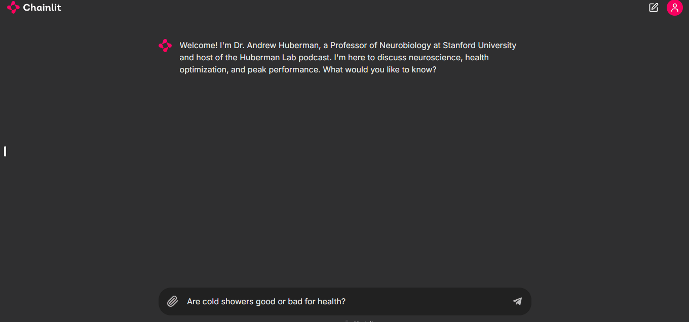

# 🎓🤖 AI Academic Assistant - Powered by Llama 3.2 & Chainlit 🚀

AI Academic Assistant is a streamlined and interactive chatbot designed to assist students and researchers. Leveraging the powerful **Llama 3.2 Model** with a user-friendly **Chainlit UI**, this tool provides fast and accurate responses without requiring local model downloads.

## ⚡ Key Features
- **Seamless Integration**: Uses the Groq API for instant responses.
- **Customizable Context**: Tailor the chatbot's behavior for academic or research needs.
- **Lightweight and Efficient**: No need for heavy local resources; API-based responses ensure fast performance.



---

## 🛠️ Setup Instructions

### 1. 🔑 API Configuration
- Rename the provided `.env_example` file to `.env`.
- Insert your **Groq API Key** in the `.env` file to authenticate and access the model.

```
GROQ_API_KEY=your_api_key_here
```

### 2. 📦 Install Dependencies
Ensure Python is installed on your system. Then, install the required libraries:

```bash
pip install -r requirements.txt
```

### 3. 🚀 Run the Application
- Adjust the **Context** in the code to fit your specific academic requirements.
- Execute the following command to launch the chatbot:

```bash
chainlit run app.py
```

🎉 The AI Academic Assistant is now up and running!

---

## 💡 Customization
You can modify the chatbot's behavior by:
- Updating the **Context** in the `app.py` script.
- Adding prompts or specific queries to align the chatbot with your academic goals.

---

## 🤝 Contributing
Contributions are welcome! Here's how you can help:

1. **Fork the Repository**: Create a copy of this project to work on.
2. **Open Issues**: Propose enhancements, report bugs, or suggest new features.
3. **Submit Pull Requests**: Share your improvements with the community.

For major changes, please open an issue first to discuss what you would like to improve.

---

## 📄 License
This project is licensed under the **MIT License**. Feel free to use, modify, and share.

---

## 🙌 Acknowledgements
Special thanks to the developers of **Llama 3.2**, **Chainlit**, and **Groq API** for making this project possible.

---

🚀 **Let's revolutionize academic assistance with AI!** 🚀
